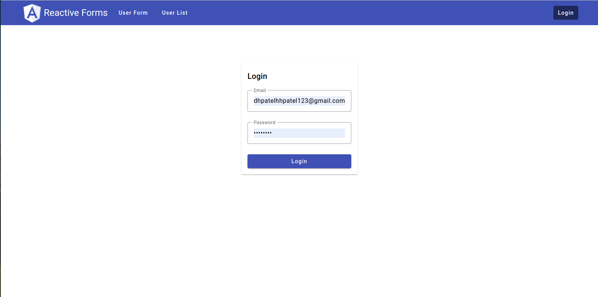

# Angular Task: Angular Reactive Forms

### Task:

- Add tabs in header for form component and list view.
- In the first tab add person details form (Form should be built using reactive forms).
- Add validation in for person details like email, mobile number, name should not be blank, etc.
- When user save person details add it to local storage to be able to load data on second visit.
- In the second tab add a material table to list persons details entered.
- Implement lazy loading for table tab and preloading for form components.
- Add login/ logout functionality to view data.
- Store user creds in local storage for 3 users with different roles.
- From those 3 creds users can login and see tables for entered details.
- Used auth-guard in angular routing to prevent non authenticated users from access data tables.
- show popup for not auth users.
- User bootstrap for UI.
- Use Subjects and Subscribers for data transfer

### Roles:

<table>
    <tr>
        <th>Role</th>
        <th>Access</th>
    </tr>
    <tr>
        <td>Customer</td>
        <td>User Form</td>
    </tr>
    <tr>
        <td>CSR</td>
        <td>User Table</td>
    </tr>
    <tr>
        <td>Admin</td>
        <td>User Form & User Table</td>
    </tr>
</table>

### Credentials:

<table>
    <tr>
        <th>Role</th>
        <th>Email</th>
        <th>Password</th>
    </tr>
    <tr>
        <td>Admin</td>
        <td>dhpatelhhpatel123@gmail.com</td>
        <td>dhp@2608</td>
    </tr>
    <tr>
        <td>CSR</td>
        <td>johndoe123@gmail.com</td>
        <td>john@321</td>
    </tr>
    <tr>
        <td>Customer</td>
        <td>jasmine2002@gmail.com</td>
        <td>flower@2002</td>
    </tr>
</table>

### Preview:

